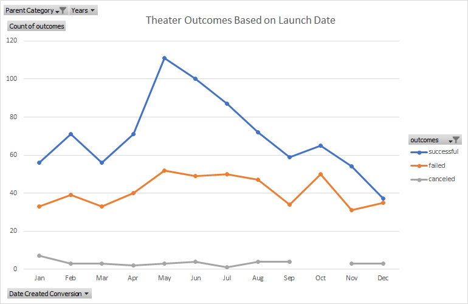

# An Analysis of Kickstarter Campaigns' Outcomes and Their Relation to Launch Date and Funding Goal
Louise noticed that one of her plays, *Fever*, came close to its funding goal in a short period of time. This led Louise to ask the question, is there a correlation between the launch date and the funding goal of a campaign and the outcome of the campaign? In this analysis, I have identified clear evidence that there is, in fact, a strong relation between the launch date/funding goal of a campaign and that campaign's outcome. This evidence also suggests there are decision that Louise could make to directly impact the success rate of her future campaigns.
---
## The Analysis
During the analysis, I paid attention to two areas of relation:
  1. The relation between a campaign's launch date and the campaign's outcome.
  2. The relation between a campaign's funding goal and the campaign's outcome.
Both of these relations have an impact on a campaign's outcome, and we'll take a closer look at the evidence for both.

### Campaign's Outcome Based on Launch Date
First, Louise wanted to take a closer look at the relation between a campaign's launch date and the campaign's outcome. To do this, I created a pivot table that organizes the outcome of every campaign by the month they were launched. Specifically, the pivot table pulled data from the main kickstarter worksheet: column F labeled Outcomes, and column S labeled Date Created Conversion. This gave me my rows, months, an my columns and measurement, outcomes (as well as the ability to filter by years). From there, I was able to utilize the pivot table filter to ensure that we were only looking at campaigns in the theater category, as well as enable Louise to look at each year individually if she wanted to dive deeper into a specific range. From there, I created this pivot line chart that maps the data from the pivot table into a month-by-month measure of successful, failed, and canceled campaigns.

---

---
Similar to the pivot table, Louise could filter this chart to, for example, view only successful, a specific year, or a different category altogether. One caution during this process: It could easy to mistake a launch date and an end date due to how close they are in the source worksheet and how close most of them are in date. I confirmed that the dates I used were the launch dates. From simply looking at the chart, we can clearly see that some months perform better than others, and we can make informed decisions off of this evidence. We'll revisit this shortly in our results analysis.

### Campaign's Outcome Based on Funding Goal
Additionally, Louise wanted to determine if there was a relation between a campaign's funding goal and its outcome. To determine if this was the case, I created another table. My 

The first major marker that indicates a campaign success/failure is the month in which it is launched. All data indicates that are best times of the year to launch a campaign. The two months I would suggest to launch a campaign is in the month of February or May.
---

Februray and May are the best options because campaigns that are launched in those months see a higher success rate, while also experiencing a lower failure rate. Similarly, June could also be an acceptable month to launch a campaign, but the difference narrows (Successful campaigns and failed campaigns are closer in number). With this information, launching a campaign in the months of December, September, and January should be avoided as the difference is significantly smaller, and in December's case, more campaigns fail than succeed.
---
---
## Campaign Goals and How They Impact Success
Another indicator of success, as it directly relates to campaigns for plays in the United States, is the goal of the campaign. I found that, typically, the higher the goal, the less likely it will succeed. The average goal of an unsuccessful campaign was $10,554, while the average of successful campaigns was $5,049. Further expressing the coorilation, the average dollars pledged to successful campaigns was $5,602, while unsuccessful campaigns only managed to average $559 pledged. It appears that total cost has an impact on whether a campaign will succeed, and $5,000 is a safe target for a goal to give a campaign a high chance of success.
---
---
## Campaign Types and Which Is Most Likely to Succeed
Finally, with all campaign data accounted for, I was able to find a total success/failure count of each type of campaign. Luckily, it appears that there is the most interest in theater-specific campaigns. There are also areas that have much less attention, and even appear to have a higher failure rate. 
---

---
Both the Food and Games categories seem to have a higher rate of failure than success. As these are both still important, I would adjust the goal and try to launch these campaigns in the months mentioned above. Continue or only slightly adjust your strategy for the music campaigns.
---
---
With all of that in mind, I would caution your Great Britain goal. I would adjust the goal to around 2,000 or less, as the majority of pledges have occurred around that amount or less.
