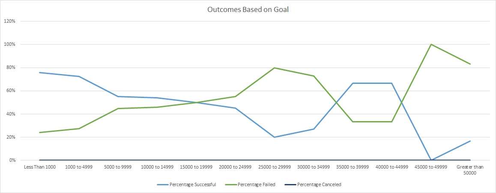

# An Analysis of Kickstarter Campaigns' Outcomes and Their Relation to Launch Date and Funding Goal
Louise noticed that one of her plays, *Fever*, came close to its funding goal in a short period of time. This led Louise to ask the question, is there a correlation between the launch date and the funding goal of a campaign and the outcome of the campaign? In this analysis, I have identified clear evidence that there is, in fact, a strong relation between the launch date/funding goal of a campaign and that campaign's outcome. This evidence also suggests there are decision that Louise could make to directly impact the success rate of her future campaigns.
---
## The Analysis
During the analysis, I paid attention to two areas of relation:
  1. The relation between a campaign's launch date and the campaign's outcome.
  2. The relation between a campaign's funding goal and the campaign's outcome.
Both of these relations have an impact on a campaign's outcome, and we'll take a closer look at the evidence for both.

### Campaign's Outcome Based on Launch Date
First, Louise wanted to take a closer look at the relation between a campaign's launch date and the campaign's outcome. To do this, I created a pivot table that organizes the outcome of every campaign by the month they were launched. Specifically, the pivot table pulled data from the main kickstarter worksheet: column F labeled Outcomes, and column S labeled Date Created Conversion. This gave me my rows, months, an my columns and measurement, outcomes (as well as the ability to filter by years). From there, I was able to utilize the pivot table filter to ensure that we were only looking at campaigns in the theater category, as well as enable Louise to look at each year individually if she wanted to dive deeper into a specific range. From there, I created this pivot line chart that maps the data from the pivot table into a month-by-month measure of successful, failed, and canceled campaigns.

---

---
Similar to the pivot table, Louise could filter this chart to, for example, view only successful, a specific year, or a different category altogether. One caution during this process: It could easy to mistake a launch date and an end date due to how close they are in the source worksheet and how close most of them are in date. I confirmed that the dates I used were the launch dates. From simply looking at the chart, we can clearly see that some months perform better than others, and we can make informed decisions off of this evidence. We'll revisit this shortly in our results analysis.

### Campaign's Outcome Based on Funding Goal
Additionally, Louise wanted to determine if there was a relation between a campaign's funding goal and its outcome. To determine if this was the case, I created another table. I broke down the funding goals into smaller ranges so that my row headers were a range of funding goals (Less than $1000, $1000-$4999, $5000-$9999, etc.) and my column headers were measurements of outcomes (Number of successful/failed/canceled campaigns, total campaigns, and the percentage of successful/failed/canceled campaigns). From there, I used a COUNTIFS function to search through the main kickstarter sheet columns to get the total amount of successful/failed/canceled campaigns for each range. For example, For the row header Less Than 1000, the COUNTIFS function searched through column D (Goal) for a value less than 1000, column F (Outcome) for a value of "successful", and column R (Subcategory) for a value of "plays". This identified every successful play campaign with a goal of 1000 or less. I repeated this for every goal range and each of their outcome values (successful/failed/canceled). I then used the SUM function to find the total number of campaigns in each goal range. Once I had that data, I was able to calculate the percentage of successful/failed/canceled campaigns per goal range by dividing the number of each campaign by the total number of campaigns in that range. This completed the table and allowed me to insert a line chart that depicted the percentage of sucessful/failed campaigns per category, with the y-axis being percentages and the x-axis being the goal ranges.

---

---
There are again clear relations between the funding goal of a campaign and that campaign's outcome. Another caution: The chart will attempt to display each measure that we took (i.e. the number of successful/failed/canceled campaigns, those sums, etc.). I had to make sure to disable all of those measurements so that we were only displaying the percentages, and this ensures our axes had the correct values. Again, these results should influence our decisions, which we will explain further below.

---
## The Results
From the Outcomes Based on Launch Date chart, we can conclude that there is a "best time" to launch a campaign. The chart shows clearly that theater campaigns launched in May are the most successful. In fact, May through July is significantly more successful than the rest of the year, and this pattern persists even when the theater filter is removed. If Louise is considering launching additional campaigns, she should do so in May, or at least between May and July. She should definitely avoid December, as the amount of successful and failed campaigns is about equal. Interestingly, there were no canceled campaigns in October, but summer months still show the most promise.

From the Outcomes Based on Goal chart, we can determine that, ultimately, keeping a play campaign funding goal under $1000 yields the most success. In fact, 76% of play campaigns with a funding goal under $1000 were successful. There is some flexability here as 73% of campaigns with a goal of $1000-$4999 were also successful, but I would certainly say the lower the goal the better the chance of success. Also, notice that campaigns with a goal of $35000-$44999 had a 66% success rate. However, with a sample size so small (9 total) I would not recommend a goal that large. Of note, there were no canceled play campaigns.

